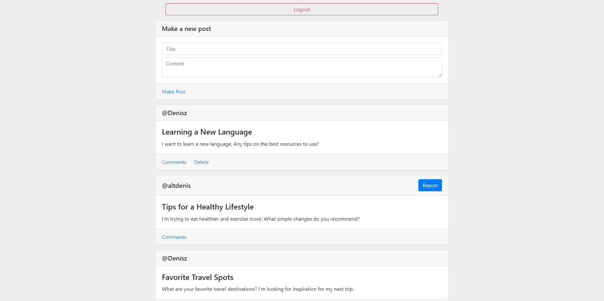
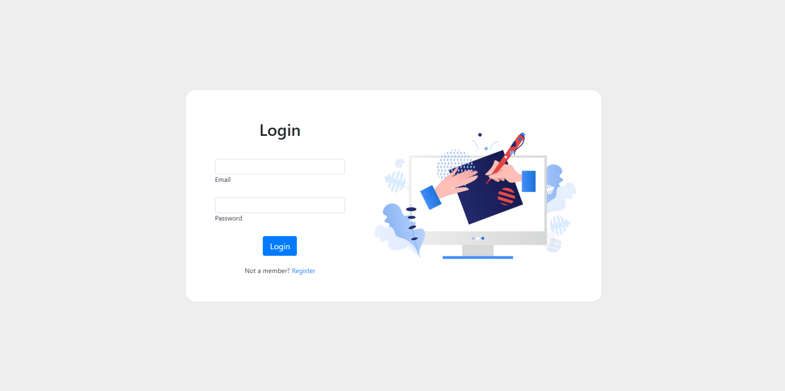
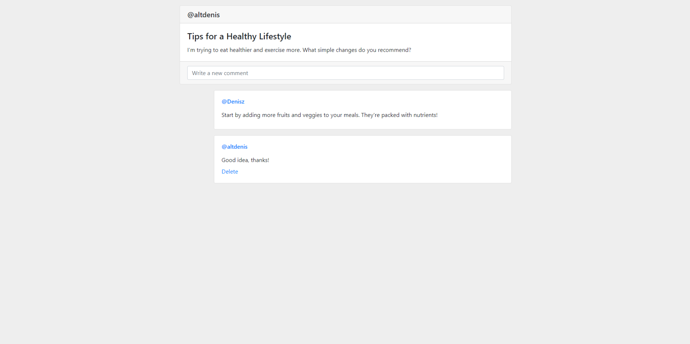

# Forum Web Application

## Overview
This forum web application is a comprehensive platform that enables users to create accounts, make posts, report inappropriate content, comment on discussions, and delete their own posts and comments. Developed using Java JSP and Hibernate ORM with a MariaDB database, the application emphasizes secure user management through JWT tokens and hashed and salted password storage. The user-friendly frontend is crafted with Bootstrap and jQuery, ensuring a seamless experience.

### Main Page

## Features
- **User Authentication:** Secure user accounts managed with JWT tokens.
- **Password Security:** Passwords are securely stored using hashing and salting techniques.
- **Create Posts:** Users can create and manage their own posts effortlessly.
- **Comment on Posts:** Engage in discussions by commenting on posts.
- **Report Posts:** Users can report inappropriate content to maintain community standards.
- **Delete Posts and Comments:** Users have the ability to delete their own posts and comments as needed.
- **Responsive Design:** A modern, intuitive interface built with Bootstrap for a great user experience on any device.
- **AJAX Functionality:** Dynamic interactions on the frontend powered by jQuery for a smooth user experience.

### Login Page

## Technologies Used
- **Backend:**
    - Java
    - JSP (JavaServer Pages)
    - Hibernate ORM
    - RESTful API
    - MariaDB (Database)

- **Frontend:**
    - HTML/CSS
    - Bootstrap
    - jQuery

### Comments Section

---

Thank you for checking out this project! We hope it inspires you to create engaging online communities. Happy coding!
